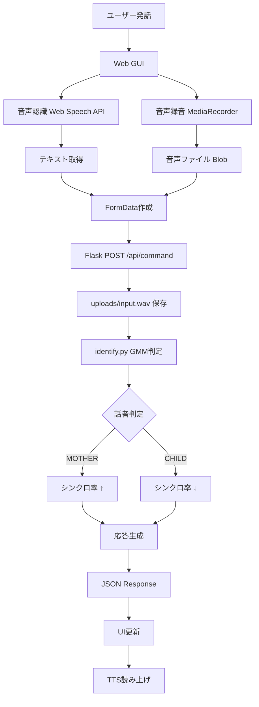

# 🎤 お母さんスイッチ - 次世代スマートスピーカー

母親の声を識別して権限レベルを管理する、機械学習ベースの音声対話システム

---

## ✨ 主な機能

### 🎯 コア機能
- **GMM話者識別**: 機械学習（混合ガウスモデル）による高精度な母親/子供の判別
- **Web音声認識**: Web Speech APIでリアルタイム音声認識
- **音声録音・送信**: MediaRecorder APIで音声データをキャプチャ&サーバー送信
- **権限管理**: シンクロ率で権限レベルを可視化（0-100%）

### 🎨 UI/UX
- 近未来的ハッカー風デザイン
- リアルタイムステータス表示
- 確信度表示（GMM/キーワード判定）
- 会話履歴タイムライン

### 🔧 拡張機能（オプション）
- Julius音声認識エンジン連携
- コマンド分類（電気ON/OFF、テレビ操作など）
- 態度判定（polite/rude/neutral）
- Open JTalk音声合成

---

## 🚀 クイックスタート

### 1️⃣ インストール

```bash
git clone https://github.com/Heart050323/new-smart-speaker.git
cd new-smart-speaker
pip install -r requirements.txt
mkdir -p data/parent data/child models logs uploads
```

### 2️⃣ 台本作成

```bash
cat > sentence.txt << 'EOF'
b01:電気をつけて:でんきをつけて
b02:電気を消して:でんきをけして
b03:テレビをつけて:てれびをつけて
b04:おやつちょうだい:おやつちょうだい
b05:宿題やりなさい:しゅくだいやりなさい
EOF
```

### 3️⃣ 学習データ録音

```bash
# 母親の音声（10ファイル以上推奨）
python3 record_hybrid.py --speaker parent --sentence sentence.txt

# 子供の音声（10ファイル以上推奨）
python3 record_hybrid.py --speaker child --sentence sentence.txt
```

### 4️⃣ モデル学習

```bash
python3 train_gmm.py
# → models/gmm.pkl が生成される
```

### 5️⃣ サーバー起動

```bash
python3 app.py
```

ブラウザで **http://localhost:5001** にアクセス 🎉

---

## 📁 プロジェクト構成

```
new-smart-speaker/
├── app.py                  # Flaskサーバー（話者識別統合済み）
├── identify.py             # GMM話者識別モジュール
├── train_gmm.py            # GMMモデル学習スクリプト
├── record_hybrid.py        # 学習データ録音ツール
├── client.py               # Julius連携モジュール
├── tts.py                  # Open JTalk音声合成
├── sentence.txt            # 録音用台本
├── requirements.txt        # Python依存関係
├── templates/
│   └── index.html          # Web GUI
├── static/
│   ├── css/styles.css      # スタイルシート
│   └── js/app.js           # フロントエンドロジック
├── data/                   # 学習データ
│   ├── parent/*.wav
│   └── child/*.wav
├── models/
│   └── gmm.pkl             # 学習済みモデル
├── uploads/
│   └── input.wav           # 受信した音声ファイル
└── logs/                   # ログファイル
```

---

## 🎮 使用方法

### Web GUIモード（推奨）

1. サーバー起動後、ブラウザで http://localhost:5001 を開く
2. **マイクボタン**をクリック → 音声認識・録音開始
3. **話しかける** → リアルタイムでテキスト表示
4. **認識確定** → 自動で録音停止 & サーバーへ送信
5. **システム応答**:
   - GMM話者識別が実行される
   - MOTHER（母親）または CHILD（子供）を判定
   - 確信度が表示される（例: 92%）
   - シンクロ率が更新される
   - 応答が読み上げられる

### Juliusモード（Ubuntu）

詳細は [README_client.md](README_client.md) を参照

```bash
# ターミナル①: Julius起動
julius -C asr/grammar-mic.jconf -module

# ターミナル②: client.py起動
python3 client.py
```

---

## 📊 システムフロー



---

## 🔧 詳細ドキュメント

| ドキュメント | 内容 |
|-------------|------|
| **[SETUP.md](SETUP.md)** | 詳細なセットアップ手順 |
| **[ARCHITECTURE.md](ARCHITECTURE.md)** | システムアーキテクチャ解説 |
| **[README_client.md](README_client.md)** | Julius連携ガイド（Ubuntu） |

---

## 📦 依存パッケージ

```
Flask==3.1.0           # Webフレームワーク
librosa==0.10.1        # 音声処理・MFCC抽出
scikit-learn==1.5.0    # 機械学習（GMM）
numpy==1.26.0          # 数値計算
webrtcvad==2.0.10      # 音声区間検出
sounddevice==0.4.6     # 録音
simpleaudio==1.0.4     # 音声再生
```

---

## 🎯 パフォーマンス

- **話者識別精度**: GMM（MFCC 13次元）で **90%以上**
- **応答速度**: **1秒以内**（識別 + 応答生成）
- **対応ブラウザ**: Google Chrome / Microsoft Edge

---

## 🐛 トラブルシューティング

### ❌ `models/gmm.pkl` が見つからない

```bash
python3 train_gmm.py
```

### ❌ Web GUIで確信度が表示されない

サーバーログを確認：
```
✅ 話者識別モジュール (identify.py) を読み込みました
```

### ❌ 音声が録音できない

- **macOS**: システム環境設定 → セキュリティとプライバシー → マイク → Chrome許可
- **Ubuntu**: `alsamixer` でマイク音量確認

---

## 📈 今後の拡張

- [ ] IoT家電連携（実際の制御）
- [ ] 複数話者対応（祖父母、兄弟など）
- [ ] 感情分析機能
- [ ] データベース連携
- [ ] スマートフォンアプリ化

---

## 📝 ライセンス

MIT License

## 👤 作者

田中 悠飛 (03250433)

---

## 🙏 謝辞

- Julius（音声認識エンジン）
- Open JTalk（音声合成）
- librosa（音声処理ライブラリ）
